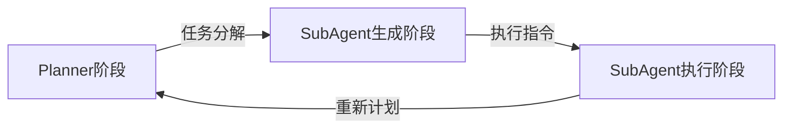

## 为何需要MultiAgent架构设计

有很多优秀的文章深入讨论MultiAgent架构的价值和设计，建议大家阅读: 

- [Effective context engineering for AI agents from Anthropic Blog](https://www.anthropic.com/engineering/effective-context-engineering-for-ai-agents)
- [How we built our multi-agent research system from Anthropic Blog](https://www.anthropic.com/engineering/multi-agent-research-system)
- [Don’t Build Multi-Agents from Cognition AI Blog](https://cognition.ai/blog/dont-build-multi-agents#principles-of-context-engineering)

MultiAgent架构的价值主要体现在：

1. **上下文压缩**: 由于模型上下文窗口限制，以及当模型上下文窗口超过50%的时候，模型推理能力会下降。通过MultiAgent架构，可以把每个Agent处理单独任务的上下文，分解限制在单独的模型上下文窗口内，从而让Agent处理更复杂，步骤更多的任务，并保证模型效能基准。
2. **注意力分配**:
  - 在Agent处理多步，且步骤目标多样的任务时，中间和后面的步骤，非常容易受到前面步骤推理与工具结果的影响。中间和后续推理结果，会受到前面步骤解法倾向的影响。以一个数据分析问题为例，通常分为三个阶段：
    - 数据结构与内容探查，了解数据字段元信息以及数据内容分布
    - 根据数据探查结果，进行数据深入分析
    - 根据数据分析结果，生成最终的数据分析报告
  - 在数据探查阶段，模型为了了解数据分布，可能会对数据做一些`mean`, `median`, `std`等统计计算，以了解数据的分布情况。由于前序代码的影响，可能增加后续分析过程对数据计算进行统计量计算的概率，但是这些过程很可能对数据分析过程并没有直接帮助，反而会让分析过程陷入对统计量计算分析的纠结。
  - 如果数据分析步骤多且任务多样，对于不同的任务类型，需要在System Prompt中提出方方面面的要求，由于注意力机制问题，在过程较长的情况下，遵守System Prompt指令的能力会下降，从而导致模型推理结果不符合预期。
3. **并行处理**: 当任务步骤比较多，且互相不存在依赖的时候，MultiAgent架构可以并行处理这些步骤，从而提高任务处理效率。

## MultiAgent架构的局限

MultiAgent架构同样存在一些不可忽视的局限，或者说，在设计上需要比较精巧处理的问题。

1. **不合理的任务分解**: 无论是并行任务处理，还是串行任务处理。如果任务分解不合理，原理上无论单个任务处理的如何"精妙"，都无法解决最终的问题。
  - 并行任务处理的时候没有遵循MECE原则，导致场景遗漏
  - 前一个任务的输出作为后一个任务的输入，但是后续任务无法根据前一个任务输出完成特定任务。举例：如果前一个任务计算一个细粒度的不可累加指标的细粒度分析，后续任务无法对这个细粒度数据进行上卷分析。

2. **上下文损失**：
    - **不合理的任务分解**: 无论是并行任务处理，还是串行任务处理。如果任务分解不合理，原理上无论单个任务处理的如何“精妙”，都无法解决最终的问题。
      - 并行任务处理的时候没有遵循MECE原则，导致场景遗漏。
      - 前一个任务的输出作为后一个任务的输入，但是后续任务无法根据前一个任务输出完成特定任务。举例：如果前一个任务计算一个细粒度的不可累加指标的细粒度分析，后续任务无法对这个细粒度数据进行上卷分析。
3. **上下文损失**：
  - 任务目标损失: 任务拆解过程中，由于缺乏全局上下文视角，导致给到子Agent的任务目标过于泛化。子Agent采用通用解法，或者是另一个场景的解法，导致合并子Agent的任务时，无法还原为原始任务。
    > 举例：原始问题是分析电商平台Q4季度高价值客户流失的根本原因，并提出挽回策略。但是拆解的第一子任务是分析客户流失率。丢失了Q4和高价值客户的两个关键过滤条件。
  - 多Agent之间的上下文损失: 对于分析型Agent，Agent之间需要将分析过程，分析结论等进行传递。但是由于上下文窗口限制，需要对上下文压缩 or offload到外部存储。常用的压缩算法基本都是基于大模型进行提取，在压缩过程中很难保障关键过程与结论不会损失。而offload到外存，需要建立合理的索引。（例如：文件目录 或者 归排索引等）。你只能对一个子领域问题建立足够的索引，很难建立一个泛化适用于所有问题的索引。因为索引规则本身也是上下文的一部分。

## MultiAgent在数据分析领域的特殊问题

相比于普通问题，数据分析类问题在MultiAgent架构下的劣势会被放大，主要体现在以下几点：
1. **数据分析类问题的上下文相比于普通问题普遍要大很多**：数据分析类问题的输入，普遍是数据文件，或者数据库表。Agent在调用数据工具的时候，产生的结果也可以是成千上万行，远超模型的上下文窗口。所以在上下文传递时，会对数据类上下文做"压缩"，或者offload到文件中。但是在数据领域，这两类工作需要同时做。通过数据"压缩"，合理地提取数据的特征，但是还是需要把原始结果保存到文件，以便后续过程做无损的数据分析。
2. **探索下钻类问题不容易做任务拆解**：大家可以想象一个数据异常问题的排查过程，通常是不同的维度进行归因，找到第一层维度的异常点。之后再一层一层的对维度进行下钻分析，直到找到数据异常的根因。但是，不恰当的任务拆解，可能在计划阶段直接把对于多个维度的下钻拆解，放到独立的子任务中。这种做法更适合符合搜索类这种广度优先的问题，但是不适合数据领域异常检测这种深度优先的问题。
3. **数据幻觉类问题在MultiAgent架构下会被加重**：数据领域常见的幻觉问题分为两类，**誊抄错误**和**心算错误**。誊抄错误指的是，后续的Agent步骤在抄写前序步骤数字的时候的抄写错误，这个在抄写超长id的时候，这类错误尤其明显。心算错误指的是，在模型推理阶段直接进行数值计算，没有用python、sql等工具。典型的心算错误是数值单位转化，将长数字缩写为X亿，XX万亿，模型对处理中文数据单位非常不擅长。在MultiAgent架构中，由于要多次增加上下文压缩，特征提取环节，大量增加这两类数据幻觉的概率。

## 数据分析Agent关键设计建议

虽然以上列出了MultiAgent架构的种种局限，但是如果还是在SingleAgent架构下，由于注意力机制和上下文窗口的局限，数据分析问题的复杂度总会有上限。为了突破这个上限，还是得直面MultiAgent架构的挑战。笔者在数据分析Agent领域有一定实践，下面从架构和工具两个视角提出一些实现的建议。

### 架构设计建议

Dynamic Task Decomposition

我基于这篇文章[Aime: Towards Fully-Autonomous Multi-Agent Framework](https://arxiv.org/abs/2507.11988)，提出一些面向数据分析的MultiAgent设计建议。但是我的这个设计建议并没有完全遵循这篇文章

1. Planner阶段：根据用户问题，拆解<mark>粗粒度</mark>的子任务，并且<mark>不要一次性拆分到底</mark>。
2. SubAgent生成阶段：每一个子任务需要对应生成一个SubAgent。为了加强SubAgent在处理这个问题的专注力，可以在Planner阶段生成针对于这个特殊任务的Persona, Task Goal, 以及Skills。 Task Goal的生成一定要<mark>粗粒度</mark>，不要将这子任务的解法作为Persona和Task Goal的一部分。Skills表示这个子Agent用到的技能。在构建SubAgent的Prompt的时候，可以动态根据Skills的内容，将这个Skills的Best Practice拼接到Prompt当中，以提升问题解决的专业度。
3. SubAgent执行阶段：子Agent建议采用React架构，SubAgent的System / User Prompt根据第二阶段动态拼接生成。
4. Planner重新计划阶段：根据子Agent的执行结果，重新生成后续任务和SubAgent的Prompt。

针对数据分析领域，Skills列表可以设定为数据探查、数据分析、搜索调研、报告生成。根据不同的技能属性，可以预先开发各个技能Best Practice Prompt模块，然后在SubAgent的Prompt中动态引入。此外Skills列表还可以控制SubAgent可以用到的工具。

SubAgent内部建议ReAct架构执行，以保持SubAgent的探索泛化能力。

### 上下文设计建议

1. 文件系统：MultiAgent架构下，要天然的用文件系统作为外置上下文管理工具。一方面起码可以做到上下文的无损offload，更重要的是，这种做法是模型训练的方向，<mark>要顺着模型训练方向做技术决策</mark>。
2. 上下文压缩：上下文压缩的目的主要有两个
   1. 索引：索引指的是对各个SubAgent产生的文件做语义索引，方便后续的SubAgent选择合适的文件读取。
   2. 洞察：对当前SubAgent的执行结果进行总结，以方便Replanner调整后续SubAgent的生成计划。

### 工具设计建议

对于工具设计的建议主要分成以下三类：
1. 通用Agent工具：类似Claude Code提供的, bash, read, write, edit, ls, grep, glob。这些都是最具泛化性的工具，也是模型训练的方向。
2. 数据类工具：
   1. SQL工具：这里核心的关键建议是，一定要注意分析目标与上下文的传递。与普通的ChatBI场景不同，用户的问题本身就接近于直接的SQL查询请求。SubAgent的查询需求是模型实际生成的，单独看查询请求本身，未必是完备的，或者只有结合充足的上下文才能够去掉SQL查询请求本身的二义性。所以SQL本身不建议作为Agent，即使作为Agent，也尽量采用类似[Handoff模式](https://openai.github.io/openai-agents-python/handoffs/)
   2. 报告类工具：我们前面提到了，模型非常容易产生数据类的誊抄与心算幻觉。引导模型或者直接提供基于代码的报告类工具。报告中的数组尽量直接用代码算出来（包括数量级转换），或者用模板语言嵌套代码渲染出来。
   3. 思考类工具：我在前面建议SubAgent尽量采用ReAct架构。但是在ReAct架构中，Prompt引导或者模型本身，都会有Observation这个步骤。这个环节同样会产生数据类幻觉。建议采用报告类工具类似的解法与减少幻觉。
   4. 强化分析类工具：数据分析类场景，有一些非常常见的分析方法。最典型的就是归因分析，计算指标变化时，相关维度和指标的贡献度。这类算法让模型自己生成code，错误概率会比较高，Prompt也很难描述这类算法。这类算法可以封装成一个工具提供给Agent去直接调用。一个算法是否要封装成一个工具，这个决策要比较谨慎，要对模型是否理解这个工具本身带来的损失和工具本身带来的准确性收益做tradeoff，毕竟模型的预训练样本里面没有你自己定义的工具。
3. GuardRails类工具：这个概念我也是跟OpenAI的AgentBuilder学的。在数据领域，则是可以做一个分析过程与结果的Critique工具，对结果进行校验。同样是否采用GuardRails类工具也要衡量准确性的收益是否能够抵消用户体验的损失（毕竟会变慢）。